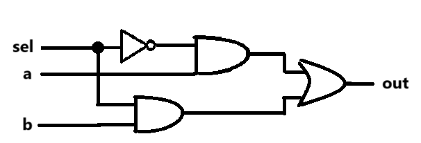
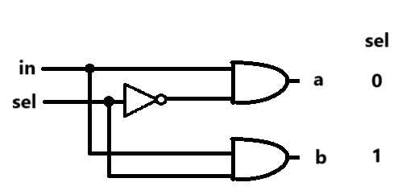
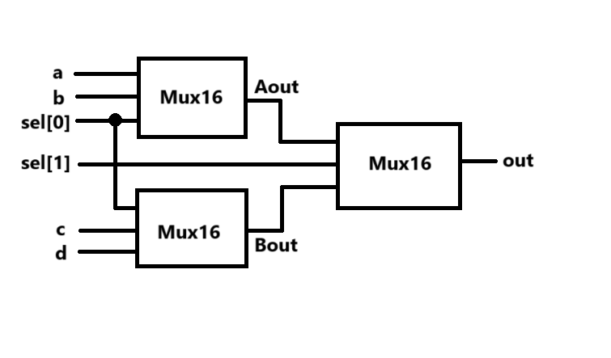
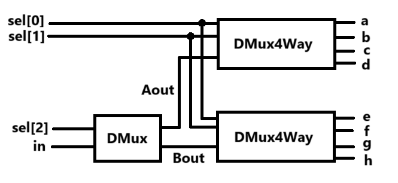

# 邏輯圖

## 第一週

### [Not](./Not.hdl)

### [And](./And.hdl)

### [Or](./Or.hdl)

### [Xor](./XOr.hdl)

### [Mux](./Mux.hdl)

### [DMux](./DMux.hdl)

## 第二週

### [Or8Way](./Or8Way.hdl)

### [Mux4Way16](./Mux4Way16.hdl)

### [Mux8Way16](./Mux8Way16.hdl)

### [DMux4Way](./DMux4Way.hdl)

### [DMux8Way](./DMux8Way.hdl)

