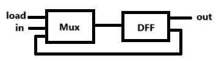
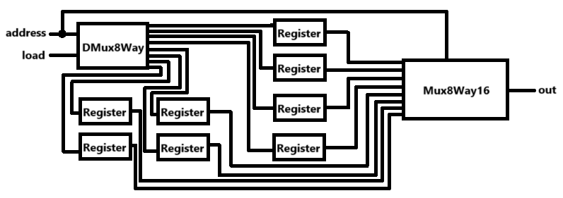
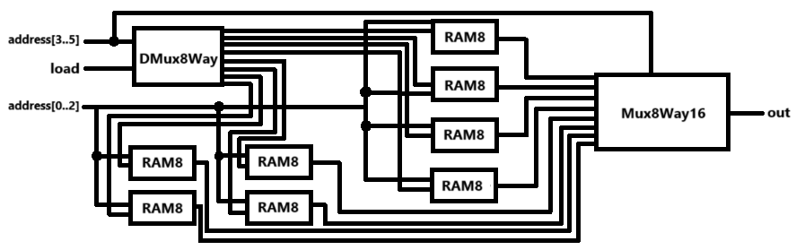
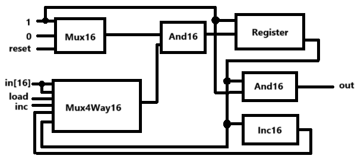

# 邏輯圖

## 第五週
### [Bit](./a/Bit.hdl)

### [Register](./a/Register.hdl)
### [RAM8](./a/RAM8.hdl)

### [RAM64](./a/RAM64.hdl)

## 第六週
### [RAM512](./b/RAM512.hdl)
[RAM64延伸(略)]()
### [RAM4K](./b/RAM4K.hdl)
[RAM64延伸(略)]()
### [RAM16K](./b/RAM16K.hdl)
[RAM64延伸(略)]()
### [PC](./a/PC.hdl)
